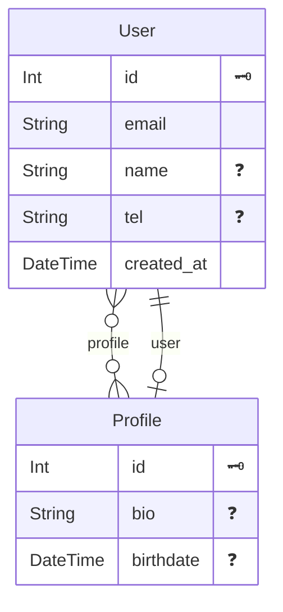

```mermaid
erDiagram

  "User" {
    Int id "🗝️"
    String email 
    String name "❓"
    String tel "❓"
    DateTime created_at 
    }
  

  "Profile" {
    Int id "🗝️"
    String bio "❓"
    DateTime birthdate "❓"
    }
  
    "User" o{--}o "Profile" : "profile"
    "Profile" o|--|| "User" : "user"
```
